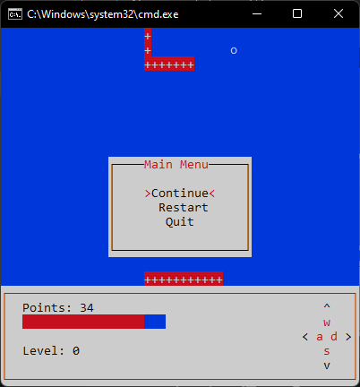
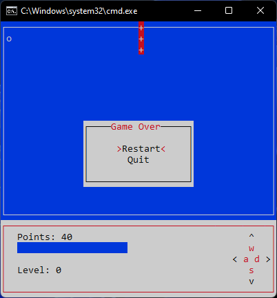

# Snake game
A simple snake game made with ncurses (Tested on windows only for now).

## How to play?
* Download and unzip the zip file from [releases](https://github.com/SrinSS01/Snake/releases/tag/1.0)  
* Then run the bat file  

</img>

This will open up the game window

</img>

After that you'll be asked to select the difficulty `which determines how fast the snake will move`  
Press any key to start the game.   

</img>

While playing if you press `ESCAPE` or `Q` it'll open the main menu

</img>  

You can :
* `continue` playing
* `restart` the game (`it'll reset all your points and levels`)
* `quit`

and if you hit a `wall` or `snake body` then it'll be game over

</img>

## How to add custom levels?

In the levels folder create a `<level-name>.snake` file  
Inside that file you need to add some commands to draw walls
### To draw horizontal line use
```
hline(x, y, '<character>' or ASCII, length)
```
### To draw vertical line use
```
vline(x, y, '<character>' or ASCII, length)
```
* x - `x position of the line`
* y - `y position of the line`
* character - `character to draw`
  * ASCII - `ascii value of the character`
* length - `length of the line`
### To draw box use
`box`
### To draw border use
```
border(ls, rs, ts, bs, tl, tr, bl, br)
```
* `ls` - left side,
* `rs` - right side,
* `ts` - top side,
* `bs` - bottom side,
* `tl` - top left-hand corner,
* `tr` - top right-hand corner,
* `bl` - bottom left-hand corner, and
* `br` - bottom right-hand corner.
#### default values :
`ls`, `rs`, `ts`, `bs` &rarr; `default_hline` or `default_vline`  
`tl` &rarr; `default_ul`  
`tr` &rarr; `default_ur`  
`bl` &rarr; `default_ll`  
`br` &rarr; `default_lr`  

## And finally you must return the starting position of the snake
```
return(x, y, <increment or decrement>, lock_x, lock_y)
```
* `x` - x co-ordinate of the snake
* `y` - y co-ordinate of the snake
* `increment or decrement` - the values will be `+1` or `-1` to determine whether to draw the snake left, right, up or down
* `lock_x` - the values will be `true` or `false` to determine whether to start moving in the x-axis
* `lock_y` - the values will be `true` or `false` to determine whether to start moving in the y-axis
  
Some useful macros: `$w` & `$h`
* `$w` - contains the game window width
* `$h` - contains the game window height
